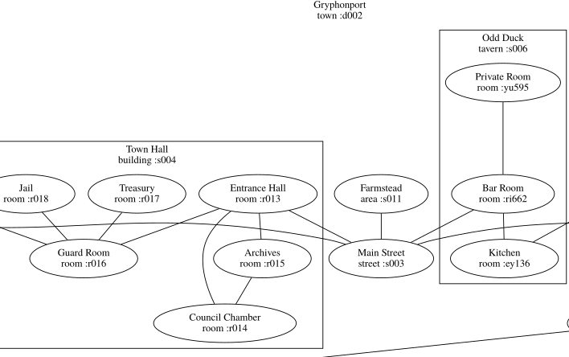

# GryphonPorT

An exploration of openai.com's ChatGPT API to build, populate, and explore a text-adventure world.

It's isn't really a game or playable yet, but some of the machinery is starting to work.

## Example "gameplay" so far:

us.chouser.gryphonport.main> (cmd **"say goodbye and go to main street"**)

`{:prompt_tokens 1555, :completion_tokens 41, :total_tokens 1596}`

(You say: Goodbye )
> You say your goodbyes and exit the Blacksmith's Workshop, heading back out onto Main Street.

> As you step onto Gryphonport's Main Street, you are immediately struck by the lively atmosphere. People bustle about, haggling with vendors over wares and exchanging news and gossip with their neighbors. The buildings lining the street are a mix of homes, shops, and other establishments, creating a vibrant atmosphere.

> From Main Street, you can access several different parts of town. South Street is a smaller street that branches off. You can hear the ringing of hammers on metal at Wilhelm's Forge nearby. A sign depicting three ducks hangs outside the door of the Odd Duck, from which spills the sounds of laughter and music. One end of Main Street connects to the Farmstead, and at the other is the impressive but rustic Town Hall.

us.chouser.gryphonport.main> (cmd **"go to odd duck"**)

`{:prompt_tokens 1832, :completion_tokens 31, :total_tokens 1863}`

> You make your way to the Odd Duck, following the sound of music and laughter.

> The Bar Room is the heart of Gryphonport's popular tavern, Odd Duck. As you step inside, you're greeted by the warm light of flickering candles and the sounds of lively conversation and music. The room is cozy and inviting, with a rustic decor that adds to its charm.

> The space is dominated by a long wooden bar, behind which stands the friendly bartender, ready to pour you a cold drink or mix up a signature cocktail. The bar is lined with a variety of bottles, some of which you recognize and others that are unfamiliar to you. You can see the skilled bartender mixing drinks, tossing bottles, and chatting with the patrons.

> The walls of the Bar Room are adorned with hunting trophies and other rustic artifacts, such as old farm tools, antlers, and mounted fish. The wooden tables and benches are well-worn and have clearly seen years of use, giving the room a sense of character and history.

> From the Bar Room, you can access the Kitchen, where delicious meals are prepared using fresh ingredients sourced from local farms and markets. There is also a Private Room, which can be reserved for special occasions or private gatherings.

> If you're looking to explore more of Gryphonport, you can exit the Bar Room and step out onto Main Street, where you'll find a variety of shops, inns, and other establishments.

us.chouser.gryphonport.main> (cmd **"go to alley"**)

`{:prompt_tokens 2212, :completion_tokens 34, :total_tokens 2246}`

> You look around the Bar Room but don't see any alleys. You might try heading back out onto Main Street instead.

## Example world graph

